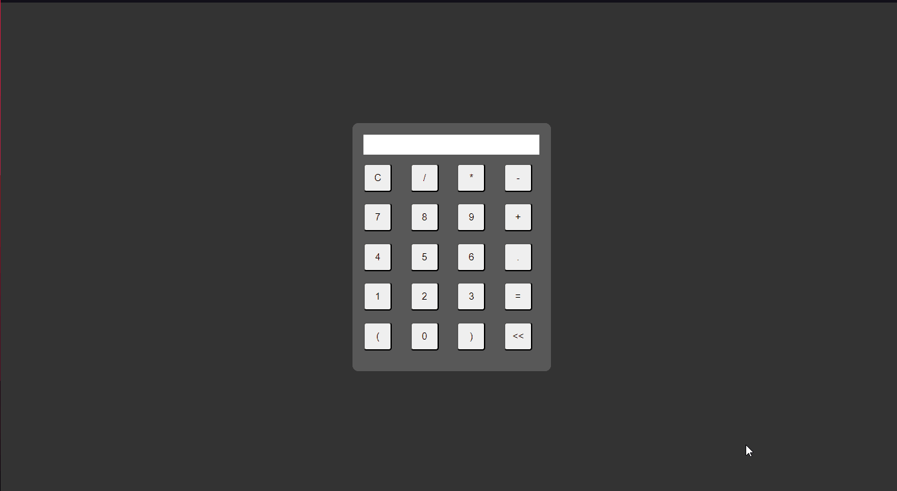

# Informações

Este repositório contém 9 projetos em HTML/CSS/JS e um projeto em ReactJS + Typescript.

## Projetos HTML/CSS/JS

Cada projeto está em sua própria pasta dentro desta pasta. Abaixo estão os projetos incluídos:

1. Calculator
2. Bigger or Smaller
3. Calc Geometrics
4. Guessing Game
5. Verify Password
6. To Do
7. Object Manipulation Communication
9. Financing Simulator
10. Manipulation API

### Como Executar e Testar

1. Navegue até a pasta do projeto desejado.
2. Abra o arquivo `index.html` em seu navegador da web.

## Projeto ReactJS + Typescript

O projeto com ReactJS + Typescript está localizado na pasta `Sales Statistics`. Este projeto foi criado com Vite.

### Como Executar e Testar

1. Navegue até a pasta do projeto ReactJS + Typescript (`Sales Statistics`).
2. Abra um terminal na pasta do projeto.
3. Execute o seguinte comando para instalar as dependências:
```
npm install
```

4. Execute o seguinte comando para iniciar o servidor de desenvolvimento:
```
npm run dev
```

5. Abra o navegador da web e acesse `http://localhost:3000` para visualizar o projeto.

## Observações
Certifique em ter o Node.js e o npm instalados em seu computador antes de executar os projetos.

### Demos
### Calculator


### Bigger or Smaller


### Calc Geometrics


### Guessing Game


### Verify Password


### To Do


### Object Manipulation Communication


### Financing Simulator


### Manipulation API